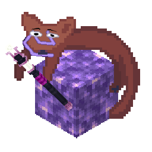

<!-- pre39-port-header:start -->
> **NeoForge 1.21.1 · Hex Casting `0.12.0-devel-pre-39` · Branch `pre39`**
>
> **原项目 / Upstream:** [https://github.com/TechTastic/HexxySkies](https://github.com/TechTastic/HexxySkies)  
> **移植基准 / Base:** [`aa0a3be11ceabe795010403626d1919db22fe584`](https://github.com/TechTastic/HexxySkies/commit/aa0a3be11ceabe795010403626d1919db22fe584)  
> **许可证 / License:** [LICENSE](LICENSE)  
> **文档 / Documentation:** [移植说明](PORTING.md) · [上游原始文档、署名与版权清单](UPSTREAM.md)
>
> This is a NeoForge port maintained by FluorineUCK, not the original upstream release. Original authorship and license notices are retained. Loader/version/build instructions in inherited upstream text describe the upstream project; the current port baseline is listed above.
<!-- pre39-port-header:end -->

# HexxySable

HexxySable is the NeoForge 1.21.1 / Hex Casting pre39 port of the navimancy addon originally developed as [HexxySkies](https://github.com/TechTastic/HexxySkies.git). This port uses the current `hexxysable` mod ID and the Sable physics integration.

See [PORTING.md](PORTING.md) for the exact upstream base and publication metadata.
